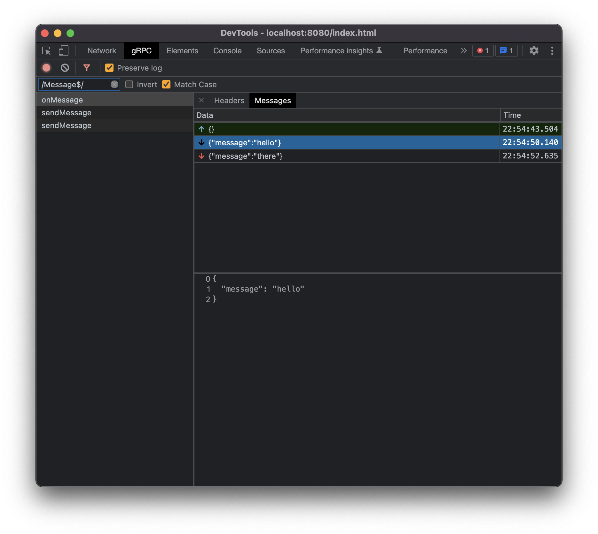

# gRPC Devtools

<div style="display: flex; justify-content: center;">
  
</div>

## Usage

```ts
const gRPCDevtoolsUnaryInterceptor =
  window.__gRPC_devtools__ &&
  window.__gRPC_devtools__.gRPCDevtoolsUnaryInterceptor;
const unaryInterceptors = gRPCDevtoolsUnaryInterceptor
  ? [gRPCDevtoolsUnaryInterceptor]
  : [];
const promiseClient = new MyServicePromiseClient(hostname, credentials, {
  unaryInterceptors: unaryInterceptors,
});
```

## TypeScript

```ts
declare const __gRPC_devtools__:
  | undefined
  | {
      gRPCDevtoolsUnaryInterceptor: UnaryInterceptor<unknown, unknown>;
    };
```

## TODOs

- Stream interceptors
- Search
- Light mode
